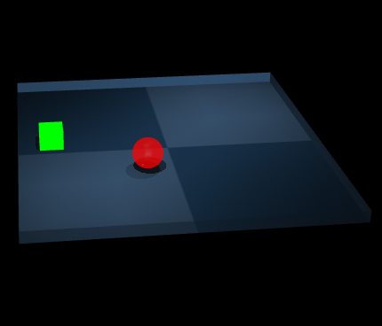
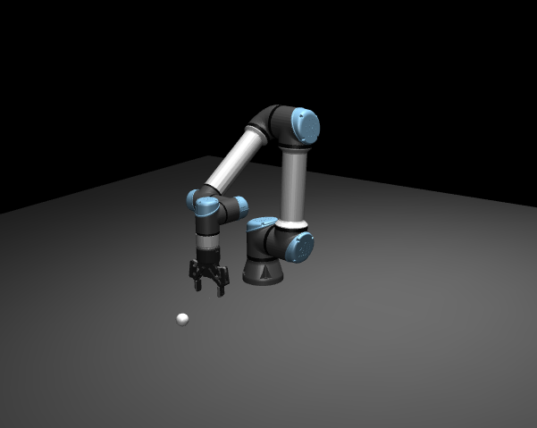
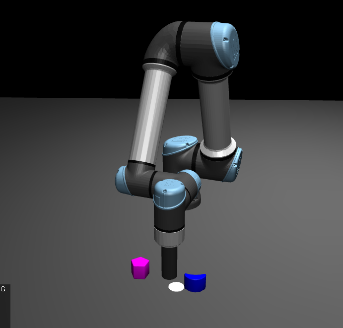
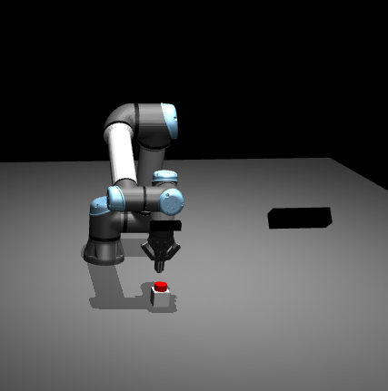

# Mujoco-sim
Learning environments for robotic manipulation using [MuJoCo](https://mujoco.readthedocs.io/en/stable/overview.html) with  [dm_control](https://github.com/google-deepmind/dm_control).

Useful to
1) get familiar with learning algorithms and compare their performance
2) for a given (real-world) task you want to tackle, tune hyperparameters, dataset size and get a feeling for the performance you can expect on real setup.

Can be used for RL (e.g. using SB3 or CleanRL) or BC (e.g. using Lerobot)

# Tasks
## Pointmass Tasks
designed to prototype or evaluate algorithms




**Reach**

Pointmass has to reach the target location marked by a green cube.
<br>
<br>
<br>


## Robot Tasks



**Reach**

The agent has to reach a target location in the Euclidean space.

<br>
<br>
<br>
<br>



**Planar Push**
The agent controls the XY coordinates of a cylindrical EEF and has to push a configurable number of objects to a target location (indicated by a white disc).

<br>
<br>


**Button Push**
The robot needs to activate a switch and then move to a specific end-pose. Observations come from a scene camera and wrist camera, the agent controls the robot joints and gripper.


# repo layout

```
mujoco_sim/
    entities/           # all phyiscal objects in the environments, using the composer.Entity abstraction
        arenas/         # roots of the entity tree, contain the 'robot setup'
        robots/         # actual robots
        eef/            # grippers etc.
        props/          # non-actuated elements
    environments/
        tasks/          # implements the actual learning tasks
        dmc2gym.py      # converts the DMC environment interface to a gym interface for interacting with most RL frameworks
    mjcf/               # contains the mjcf xml files for all the entities
    scripts/
        lerobot/        # config and code to train BC algo's
        sb3/            # config and code to train SB3 RL algo's
        demo_collection.py # code to create demonstrations and store them in the appropriate dataset format
```
# installation

- `git clone`
- `git submodules update --init`
- `conda env create -f environment.yaml`

for learning:
- `pip install sb3`
- `pip install -e lerobot/`


# Resources
- Kevin Zakka's [RoboPianist](https://kzakka.com/robopianist/)
- DM_control [tutorial](https://arxiv.org/pdf/2006.12983#page=14.38)